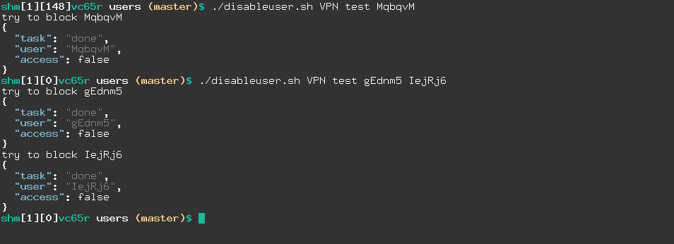

# secli
pure Bash CLI to manage SoftEther VPN Server using JSON-RPC

SoftEther server can be managed by JSON-RPC, but there was not a CLI to manage it from a Terminal.  
`secli` tries to be a SE server client written in Bash to manage a SE server.

## prerequisites
The CLI needs the following in order to function properly:  

- [Bash](https://www.gnu.org/software/bash/) v4.4 or higher
- [perl](https://www.perl.org/) 
- jq [project](https://stedolan.github.io/jq/), [download](https://stedolan.github.io/jq/)
- yq [project](https://github.com/mikefarah/yq), [download](https://github.com/mikefarah/yq/releases)
- some other Linux commands. e.g. printf, grep, etc

## CIL architecture
Unlink traditional Unix/Linux CLIs which all the functionalities are managed by options (i.e `--option`); `secli` uses **Pipeline Architecture**. 
This architecture helps to have:  
- software testability
- software modularity
- software extendability
- component/function reusability
- and more

[See Software Non-functional requirement](https://en.wikipedia.org/wiki/Non-functional_requirement).  


Thus `secli` does not follow traditional option based CLIs, as you might expect like bellow samples:

```bash
./secli --admin --admin-password <PASSWORD> --add-user --user-name XYZ --user-pass 123@XYZ --enable-policy vpn.example.com
```

And `secli` handles its functionality using pipe (**Name Pipe in Linux** == `|`). Here are examples

### run Test query, no thing else

```bash
./secli.sh Test
{
  "jsonrpc": "2.0",
  "id": "rpc_call_id",
  "method": "Test",
  "params": {
    "IntValue_u32": 0
  }
}
```

 - Test: the JSON-RPC for testing the server is up or no

### run Test + add server configuration

```bash
./secli.sh Test | ./secli.sh config -f sample.admin.yaml -t usa
{
  "se_cred": {
    "address": "usa.example.com",
    "port": 443,
    "password": "XCFuydZ4m2xMRF7O"
  },
  "rpc_json": {
    "jsonrpc": "2.0",
    "id": "rpc_call_id",
    "method": "Test",
    "params": {
      "IntValue_u32": 0
    }
  }
}
```

 - Test: the JSON-RPC for testing the server is up or no
 - config: add our server credentials to the JSON-RPC 

### run Test + Config + apply it

```
./secli.sh Test | ./secli.sh config -f sample.admin.yaml -t usa | ./secli.sh apply
{
    "result": {
        "Int64Value_u64": 0,
        "IntValue_u32": 0,
        "StrValue_str": "0",
        "UniStrValue_utf": ""
    },
    "jsonrpc": "2.0",
    "id": "rpc_call_id"
}
```

 - Test: the JSON-RPC for testing the server is up or no
 - config: add our server credentials to the JSON-RPC 
 - apply: send JSON-RPC of Test to server and use credentials for authentication

### GetUser info  (real example)

```bash
./secli.sh GetUser --hub VPN --user <***>  | ./secli.sh config -f admin.yaml -t usa | ./secli.sh apply | ./secli.sh parse -m GetUser
- hub: VPN
  username: ***
  realname: ***.***
  access: true
  logins: 161
  ctime: "2022-11-09T20:58:09.963Z"
  etime: "2023-12-30T20:30:00.000Z"
  traffic:
    have: 40000000000
    used: 1981792560
    rest: 38018207440
```

 - GetUser: use GitUser JSON-RPC
 - config: read configuration for usa server
 - apply: send request to the SE server
 - parse: parse GetUser output and convert it to YAML

The YAML output is produced by `secli` parsing SE server response which is in JSON. `secil` converts JSON to YAML.  

---

## challenges you can solve with `secli`
Here are some common challenges SE users face.  
You can use `secli` to tackle them.  

### 1. disable a user or users (more than one)

**First**

Get/Save list of all user names

```bash
./secli EnumUser --hub VPN | \
    ./secli config -f admin.yaml -t usa | \
    ./secli apply | \
    jq -r '.result.UserList[].Name_str' > list.txt
```

 - HUB is `VPN`
 - server is usa


**Second**

Get targeted server and user names to deal with 

```bash
declare _hub="${1:?hub name}";
declare _target="${2:?target name}"
declare -a list_users=(${@:3});

if (( ${#list_users[0]} == 0 )); then
    printf 'at least one user name is needed\n';
    exit 1;
fi
```

and find them if matched + call a function to disable them.  

```bash
while read username; do
    for a_user in "${list_users[@]}"; do
        if [[ $username == $a_user ]]; then
            block_user $username;
        fi
    done
done < list.txt;
```

**Third**  

Block them and show the result for each user

```bash
function block_user(){
    declare username;
    username="${1:?user name is needed}";
    printf 'try to block %s\n' $username;

    ./secli GetUser  --hub $_hub --user $username | \
    ./secli config -f admin.yaml -t $_target | \
    ./secli apply | \
    jq '.result."policy:Access_bool"=false' | \
    ./secli SetUser | \
    ./secli config -f admin.yaml -t $_target | \
    ./secli apply | \
    jq '{ "task": "done", "user": .result.Name_str, "access": .result."policy:Access_bool" }'
}
```

**Screenshot**



**Bash Script**

Here is a script you can use [shots/statuser.png](shots/statuser.png)

---

### 2. stat a user or users (more than one)

**Screenshot**


**Bash Script**

Here is a script you can use [scripts/statuser.sh](scripts/statuser.sh)


---

## JSON-RPCs have been added

 - `Test                 Test RPC function`
 - `GetServerInfo        Get server information`
 - `GetServerStatus      Get Current Server Status`
 - `CreateListener       Create New TCP Listener`
 - `EnumListener         Get List of TCP Listeners`
 - `DeleteListener       Delete TCP Listener`
 - `EnableListener       Enable / Disable TCP Listener`
 - `CreateUser           Create a user`
 - `SetUser              Change User Settings`
 - `GetUser              Get User Settings`
 - `DeleteUser           Delete a user`
 - `EnumUser             Get List of Users`

Others will be added gradually.  
You can ask/request for new JSON-RPC be added or contribute and send PR (Pull Request).  
[Here is the full list](https://github.com/SoftEtherVPN/SoftEtherVPN/tree/master/developer_tools/vpnserver-jsonrpc-clients).

