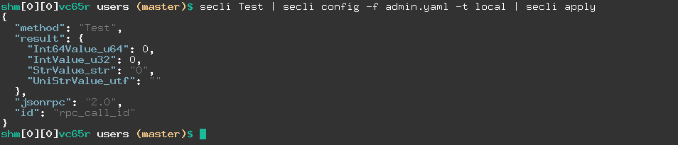

# secli
Bash CLI to manage SoftEther VPN Server using JSON-RPC

SoftEther server can be managed by JSON-RPC, but there was not a CLI to manage it from a Terminal.  
`secli` tries to be a SE server client written in Bash to manage a SE server.

## prerequisites
The CLI needs the following in order to function properly:  

- [Bash](https://www.gnu.org/software/bash/) v4.4 or higher
- jq [project](https://stedolan.github.io/jq/), [download](https://stedolan.github.io/jq/)
- yq [project](https://github.com/mikefarah/yq), [download](https://github.com/mikefarah/yq/releases)
- [perl](https://www.perl.org/) 
- some other Linux commands. e.g. printf, grep, etc

## CIL architecture
Unlink traditional Unix/Linux CLIs which all the functionalities are managed by options (i.e `--option`); `secli` uses **Pipeline Architecture**. 
This architecture helps to have:  
- software testability
- software modularity
- software extendability
- component/function reusability
- and more

[See Software Non-functional requirement](https://en.wikipedia.org/wiki/Non-functional_requirement).  


Thus `secli` does not follow traditional option based CLIs, as you might expect like bellow samples:

```bash
./secli --admin --admin-password <PASSWORD> --add-user --user-name XYZ --user-pass 123@XYZ --enable-policy vpn.example.com
```

And `secli` handles its functionality using pipe (**Name Pipe in Linux** == `|`). Here is an example apply Test:

### Test (Test RPC function)

```bash
secli Test | secli config -f admin.yaml -t local | secli apply
```

Output:

```json
{
  "method": "Test",
  "result": {
    "Int64Value_u64": 0,
    "IntValue_u32": 0,
    "StrValue_str": "0",
    "UniStrValue_utf": ""
  },
  "jsonrpc": "2.0",
  "id": "rpc_call_id"
}
```

 - Test: the JSON-RPC for testing the server is up or no
 - config: add our server credentials to the JSON-RPC 
 - apply: send JSON-RPC of Test to server and use credentials for authentication

And **admin.yaml** file is:

```yaml
secli:
  local:
    address: localhost
    port: 443
    password: 1234
```

 - local: a target name for `-t`
 - address: SE server address (domain name) or IP
 - port: SE server port
 - password: SE server administrator password




---

## JSON-RPCs have been added

 - `Test                 Test RPC function`
 - `GetServerInfo        Get server information`
 - `GetServerStatus      Get Current Server Status`
 - `CreateListener       Create New TCP Listener`
 - `EnumListener         Get List of TCP Listeners`
 - `DeleteListener       Delete TCP Listener`
 - `EnableListener       Enable / Disable TCP Listener`
 - `CreateUser           Create a user`
 - `SetUser              Change User Settings`
 - `GetUser              Get User Settings`
 - `DeleteUser           Delete a user`
 - `EnumUser             Get List of Users`
 - `EnumSession          Get List of Connected VPN Sessions`
 - `GetSessionStatus     Get Session Status`
 - `DeleteSession        Disconnect Session`

Others will be added gradually.  
You can ask/request for new JSON-RPC be added or contribute and send PR (Pull Request).  
[Here is the full list](https://github.com/SoftEtherVPN/SoftEtherVPN/tree/master/developer_tools/vpnserver-jsonrpc-clients).


## features

Beyond common expected functionalities  

 - add a user
 - delete a user
 - enable / disable a user
 - etc

There are out-of-box features  

 - human readable output
 - three output formats (JSON, YAML, table)
 - set a user data limitation and block if exceeded

Planned more will be added

## samples

**List of users of a HUB in table format on my local machine**  
It could be any server anywhere.  


```bash
secli user --enum local vpn | secli parse --table
```

output

```bash
hub  username  realname     blocked  logins  etime                 llogin                traffic
vpn  491bxd    user_491bxd  false    0       2023-03-09T23:39:30Z  1970-01-01T09:00:00Z  1073741824  0          1073741824
vpn  7ehhzq    user_7ehhzq  false    0       2023-03-09T23:33:53Z  1970-01-01T09:00:00Z  1073741824  0          1073741824
vpn  bh0i1s    user_bh0i1s  false    0       2023-03-09T23:31:24Z  1970-01-01T09:00:00Z  1073741824  0          1073741824
vpn  d36que    user_d36que  false    0       2023-03-09T23:33:35Z  1970-01-01T09:00:00Z  1073741824  0          1073741824
vpn  eutjiy    user_eutjiy  false    0       2023-03-09T23:35:58Z  1970-01-01T09:00:00Z  1073741824  0          1073741824
vpn  fkxaci    user_fkxaci  false    0       2023-03-09T23:26:37Z  1970-01-01T09:00:00Z  1073741824  0          1073741824
vpn  h9xein    user_h9xein  false    0       2023-03-09T23:33:21Z  1970-01-01T09:00:00Z  1073741824  0          1073741824
vpn  tmit5k    user_tmit5k  false    0       2023-03-09T23:28:48Z  1970-01-01T09:00:00Z  1073741824  0          1073741824
vpn  uyybel    user_uyybel  false    0       2023-03-09T23:26:56Z  1970-01-01T09:00:00Z  1073741824  0          1073741824
vpn  vpn       shakiba      false    28      2023-12-30T20:30:00Z  2023-02-10T11:39:16Z  9000000000  329668722  8670331278
```

**List online users (sessions) of a HUB in YAML format.**


```bash
secli session --enum local vpn | secli parse --yaml
```

output

```yaml
- username: Cascade
  client_ip: '::'
  session_id: SID-LINK-1
  hostname: '-'
  max_tcp: 0
  uptime: 1324
  index: 1
- username: vpn
  client_ip: 192.168.1.178
  session_id: SID-VPN-[L2TP]-2
  hostname: 192.168.1.178
  max_tcp: 1
  uptime: 21
  index: 2
```

or table format

```bash
secli session --enum local vpn | secli parse --table
```

output

```bash
username  client_ip      session_id        hostname       max_tcp  uptime  index
Cascade   ::             SID-LINK-1        -              0        1332    1
vpn       192.168.1.178  SID-VPN-[L2TP]-2  192.168.1.178  1        29      
```

By default it will be JSON format

```bash
secli session --enum local vpn
```

output


```json
{
  "method": "EnumSession",
  "parsed": true,
  "result": [
    {
      "username": "Cascade",
      "client_ip": "::",
      "session_id": "SID-LINK-1",
      "hostname": "-",
      "max_tcp": 0,
      "uptime": 1544,
      "index": 1
    },
    {
      "username": "vpn",
      "client_ip": "192.168.1.178",
      "session_id": "SID-VPN-[L2TP]-2",
      "hostname": "192.168.1.178",
      "max_tcp": 1,
      "uptime": 241,
      "index": 2
    }
  ]
}
```

## contributors 

Any new 
 - ideas
 - functionalities
 - RPC-JSON support
 - PR (pull request)
    - you know Bash + best practices of coding
 - Bug reports 

are welcome.

## license
